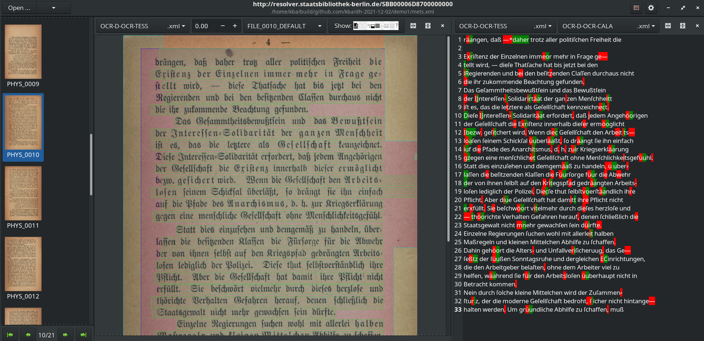
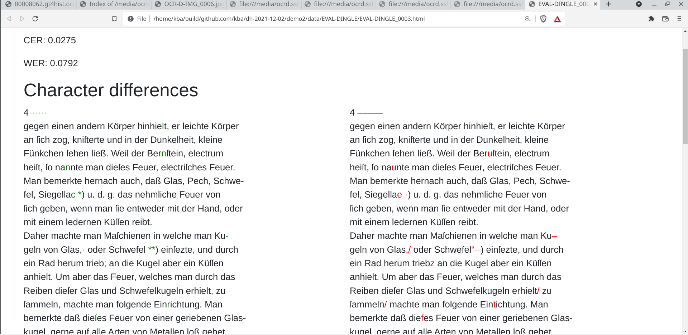
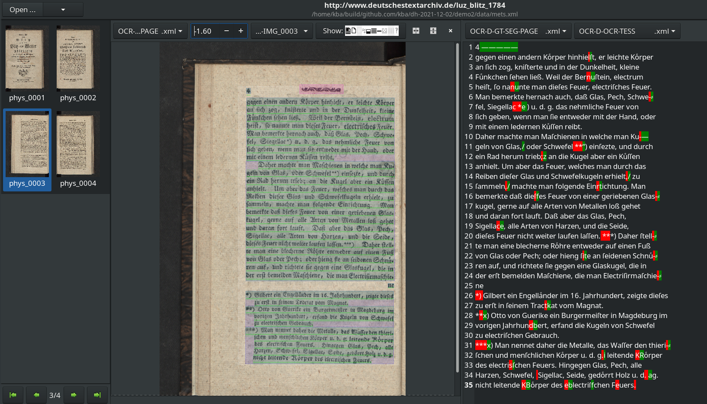

# Hinter den Kullissen der Staatsbibliothek - Texterkennung/OCR

## Demo 1 - Einfache und komplexe Workflows

### METS URL

* Browsen nach https://digital.staatsbibliothek-berlin.de/werkansicht?PPN=PPN680203753
* Kopieren der METS-URL https://content.staatsbibliothek-berlin.de/dc/PPN680203753.mets.xml

### Von METS zum Workspace

```sh
mkdir demo1
cd demo1
ocrd workspace clone https://content.staatsbibliothek-berlin.de/dc/PPN680203753.mets.xml
```

### Welche Dateien sind vorhanden?

```sh
ocrd workspace find -k url -k mimetype -k fileGrp
```

### Laden wir uns die Bilder herunter

```
ocrd workspace find --file-grp DEFAULT --download
```

### Minimaler OCR-Workflow mit tesseract

#### Laden des GT4Hist Modells

```sh
ocrd resmgr download ocrd-tesserocr-recognize Fraktur_GT4HistOCR.traineddata
```

#### Workflow

Workflow-Dokumentation: https://ocr-d.de/en/workflows

```sh
ocrd-tesserocr-recognize -P segmentation_level region -P textequiv_level word -P find_tables true -P model Fraktur_GT4HistOCR -I DEFAULT -O OCR-D-OCR-TESS
```

#### ppn2ocr

Mit dem Skript `ppn2ocr` aus dem Projekt https://github.com/qurator-spk/ocrd-galley können Sie Werke der Staatsbibliothek "in einem Rutsch" mit voller Auflösung als OCR-D-Workspace herunterladen:

```sh
ppn2ocr PPN680203753
```

### Komplexerer Workflow mit Calamari

#### Laden des GT4Hist Modells

```sh
ocrd resmgr download ocrd-calamari-recognize qurator-gt4histocr-1.0
```

#### Workflow

```sh
ocrd process \
  "skimage-binarize -I DEFAULT -O OCR-D-BIN2 -P method li" \
  "skimage-denoise -I OCR-D-BIN2 -O OCR-D-BIN-DENOISE -P level-of-operation page" \
  "tesserocr-deskew -I OCR-D-BIN-DENOISE -O OCR-D-BIN-DENOISE-DESKEW -P operation_level page" \
  "cis-ocropy-segment -I OCR-D-BIN-DENOISE-DESKEW -O OCR-D-SEG -P level-of-operation page" \
  "cis-ocropy-dewarp -I OCR-D-SEG -O OCR-D-SEG-LINE-RESEG-DEWARP" \
  "calamari-recognize -I OCR-D-SEG-LINE-RESEG-DEWARP -O OCR-D-OCR-CALA -P checkpoint_dir qurator-gt4histocr-1.0"
```

### Vergleichen wir die Ergebnisse mit browse-ocrd

```sh
browse-ocrd mets.xml
```



## Demo 2 - Evaluation von OCR-Ergebnissen

```sh
mkdir demo2
cd demo2
```

### Laden wir uns ein Werk aus dem OCR-D-GT-Repo

OCR-D-GT-Repo: http://ola-hd.ocr-d.de

* Suchen nach `luz`
* Quick Export

```sh
unzip quick-export.zip
cd data
```

### Tesseract Workflow

```sh
ocrd-tesserocr-recognize -P segmentation_level region -P textequiv_level word -P find_tables true -P model Fraktur_GT4HistOCR -I OCR-D-IMG -O OCR-D-OCR-TESS
```

### Evaluation mit dinglehopper

```
ocrd-dinglehopper -I OCR-D-GT-SEG-LINE,OCR-D-OCR-TESS -O EVAL-DINGLE
```

### CER und WER

```json
{
    "gt": "OCR-D-GT-SEG-LINE/OCR-D-GT-SEG-LINE_0003.xml",
    "ocr": "OCR-D-OCR-TESS/OCR-D-OCR-TESS_0003.xml",

    "cer": 0.02749551703526599,
    "wer": 0.07924528301886792,

    "n_characters": 1673,
    "n_words": 265
}
```

### Browser-Ansicht



### Diff-View in browse-ocrd


